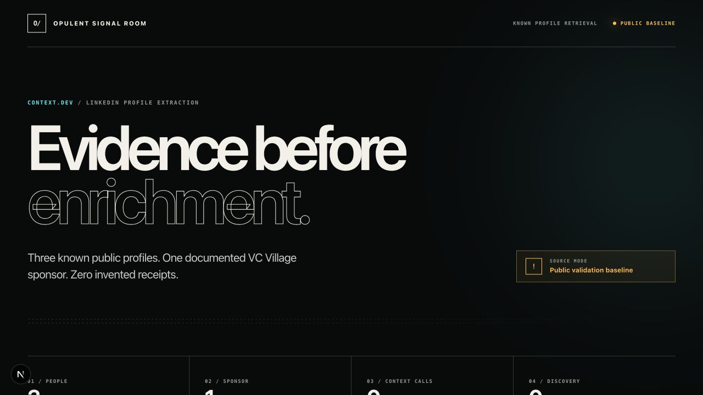

# Opulent LinkedIn Context Showcase

An isolated Codex skill and evidence dashboard for retrieving a small, approved set of **known public LinkedIn profiles** through Context.dev. The sample demonstrates the workflow against three Goodwin professionals. A public VC Village NYC event page identifies Goodwin as a sponsor; that is a firm-level affiliation, not a claim about the individuals.



## What this proves

- exact `POST https://api.context.dev/v1/people/retrieve` request construction;
- one call per deduplicated known LinkedIn URL;
- credential, retry, receipt, and failure-isolation behavior;
- public-source identity corroboration;
- contact-data redaction and claim-boundary validation; and
- a responsive, original dither-chart dashboard suitable for Opulent demos.

The committed sample packet is a `public_validation_baseline`, not a fabricated Context.dev response. A live extraction is only successful when `.scratch/contextdev/<run-id>/` contains per-profile receipts produced with a valid API key and private-alpha endpoint access.

## Quick start

```bash
npm install
npm run dashboard:install
npm run selftest
npm --prefix dashboard run dev
```

Open <http://localhost:3000>.

## Live Context.dev scenario

```bash
export CONTEXT_DEV_API_KEY=ctxt_secret_...
npm run context:live
npm run build:packet -- --manifest .scratch/contextdev/<run-id>/manifest.json
npm run validate
npm run dashboard:build
```

Raw provider responses stay under `.scratch/` and are ignored by git. The public packet contains only an allowlisted professional subset and safe execution metadata.

## Repository map

- `SKILL.md` — agent workflow and safety boundaries
- `fixtures/public-profile-baseline.json` — source-linked public validation input
- `scripts/contextdev_people.mjs` — real Context.dev client
- `scripts/build_showcase.mjs` — safe packet builder
- `scripts/validate_packet.mjs` — evidence/claim validator
- `dashboard/` — Next.js dither dashboard
- `scenarios.jsonl` — fixture and credentialed live scenarios

## Safety boundary

This project does not automate LinkedIn login, defeat access controls, discover people, infer personal contact details, send outreach, make employment decisions, or perform bulk scraping. It retrieves only exact public URLs that were already selected, through Context.dev's documented API.

## Design lineage

The visual direction is informed by the public [Opulent GTM Intelligence skill](https://github.com/OpulentiaAI/opulent-gtm-intelligence/tree/main/skills/opulent-gtm-intelligence). Because that repository did not expose a license when reviewed, this repo uses an independently written dither-chart implementation and does not copy its source.

## License

MIT
